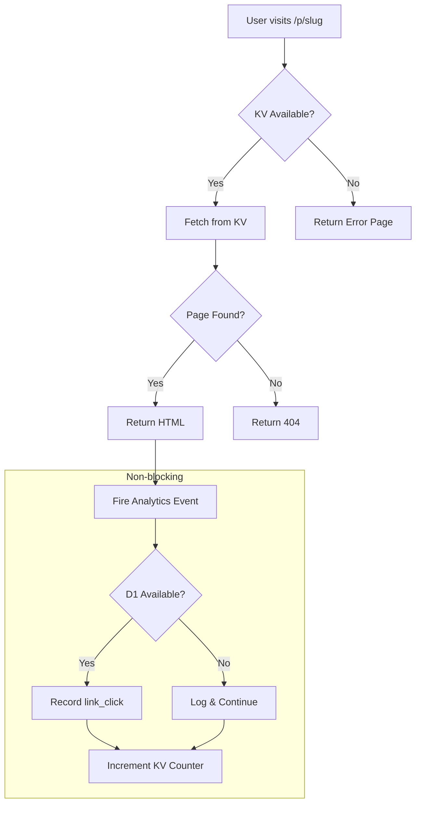

# Design Document: KV Error Handling & Link Click Analytics

## Overview

This feature adds robust error handling for Cloudflare KV operations and implements link click analytics tracking for landing pages. The design prioritizes graceful degradation - landing pages should always be served when possible, even if analytics or KV operations fail.

## Architecture



## Components and Interfaces

### 1. KV Error Handler (`app/src/lib/kvErrorHandler.ts`)

```typescript
interface KVErrorResult {
  success: boolean;
  error?: string;
  errorCode?: 'KV_UNAVAILABLE' | 'KV_READ_ERROR' | 'KV_WRITE_ERROR' | 'NOT_FOUND';
}

// Check KV availability
function isKVAvailable(kv: KVNamespace | undefined): boolean;

// Safe KV get with error handling
async function safeKVGet<T>(kv: KVNamespace, key: string): Promise<{ data: T | null; error?: KVErrorResult }>;

// Safe KV put with retry logic
async function safeKVPut(kv: KVNamespace, key: string, value: string, retries?: number): Promise<KVErrorResult>;

// Generate branded error page HTML
function generateErrorPage(errorCode: string, slug?: string): string;
```

### 2. Analytics Service (`app/src/lib/analytics.ts`)

```typescript
interface LinkClickEvent {
  slug: string;
  timestamp: string;
  referrer: string | null;
  userAgent: string | null;
  projectId?: string;
}

interface AnalyticsSummary {
  slug: string;
  totalClicks: number;
  clicksByDay: { date: string; count: number }[];
}

// Record link click (fire-and-forget)
function recordLinkClick(db: D1Database | undefined, kv: KVNamespace | undefined, event: LinkClickEvent): void;

// Get analytics for a slug
async function getSlugAnalytics(db: D1Database, slug: string, days?: number): Promise<AnalyticsSummary>;

// Get all landing page analytics
async function getAllAnalytics(db: D1Database, days?: number): Promise<AnalyticsSummary[]>;
```

### 3. Updated Landing Page Handler (`app/src/pages/p/[slug].ts`)

The existing handler will be updated to:
- Use `safeKVGet` for error handling
- Call `recordLinkClick` in fire-and-forget manner
- Return branded error pages for different error conditions

### 4. Analytics API Endpoint (`app/src/pages/api/admin/analytics.ts`)

```typescript
// GET /api/admin/analytics
// Query params: slug (optional), days (default: 30)
// Returns: AnalyticsSummary or AnalyticsSummary[]
```

## Data Models

### D1 Events Table (existing, extended)

New event type: `link_click`

```sql
-- Event data JSON structure for link_click
{
  "slug": "warung-makan-bu-sri",
  "referrer": "https://wa.me/...",
  "user_agent": "Mozilla/5.0...",
  "project_id": "proj_123..."
}
```

### KV View Counter

```
Key: views:{slug}
Value: number (integer count)
```

### KV Landing Page Data (existing, extended)

```typescript
interface LandingPageKVData {
  html: string;
  businessName: string;
  projectId: string;
  createdAt: string;
  template: string;
  colorTheme: string;
  viewCount?: number; // Added for quick access
}
```

## Correctness Properties

*A property is a characteristic or behavior that should hold true across all valid executions of a system-essentially, a formal statement about what the system should do. Properties serve as the bridge between human-readable specifications and machine-verifiable correctness guarantees.*

### Property 1: KV unavailable returns branded error page
*For any* slug input, when KV is undefined, the response SHALL contain OCTOmatiz branding elements and appropriate error messaging
**Validates: Requirements 1.1**

### Property 2: Deployment without KV returns storage error
*For any* valid project input, when KV is undefined during deployment, the response SHALL indicate storage unavailability with success=false
**Validates: Requirements 1.2**

### Property 3: KV read failure returns 503
*For any* slug input, when KV.get throws an error, the response status SHALL be 503 Service Unavailable
**Validates: Requirements 1.3**

### Property 4: KV write retry on failure
*For any* valid deployment, when KV.put fails on first attempt but succeeds on retry, the deployment SHALL succeed
**Validates: Requirements 1.4**

### Property 5: Successful access records link_click event
*For any* successful landing page access (KV returns valid data), a link_click event SHALL be recorded in D1
**Validates: Requirements 2.1**

### Property 6: Link click event contains required fields
*For any* recorded link_click event, the event_data SHALL contain slug, timestamp, referrer, and user_agent fields
**Validates: Requirements 2.2**

### Property 7: D1 failure does not block page response
*For any* landing page access, when D1 is unavailable for analytics, the page SHALL still return 200 with valid HTML
**Validates: Requirements 2.3**

### Property 8: View counter increments on access
*For any* landing page access, the KV view counter for that slug SHALL increment by 1
**Validates: Requirements 2.4**

### Property 9: Analytics API returns correct totals
*For any* set of recorded link_click events for a slug, the analytics API SHALL return the correct total count
**Validates: Requirements 3.1**

### Property 10: Analytics groups by day correctly
*For any* set of link_click events across different days, the clicksByDay array SHALL correctly group and count events per day
**Validates: Requirements 3.2**

### Property 11: Analytics non-blocking pattern
*For any* landing page access, the response SHALL be returned before analytics recording completes (fire-and-forget)
**Validates: Requirements 4.1**

### Property 12: Analytics failure does not affect response
*For any* landing page access, when analytics recording throws an error, the page response SHALL still be successful
**Validates: Requirements 4.2**

## Error Handling

### KV Errors

| Error Condition | Response | User Message |
|----------------|----------|--------------|
| KV undefined | 503 | "Layanan sedang tidak tersedia" |
| KV.get throws | 503 | "Gagal memuat halaman" |
| KV.put fails (after retry) | 500 | "Gagal menyimpan halaman" |
| Key not found | 404 | "Halaman tidak ditemukan" |

### Analytics Errors

Analytics errors are logged but never block the main response:
- D1 unavailable: Log warning, continue
- Event insert fails: Log error, continue
- KV counter update fails: Log warning, continue

## Testing Strategy

### Unit Tests
- Test `isKVAvailable` with undefined and defined KV
- Test `generateErrorPage` produces valid HTML with branding
- Test `safeKVGet` error handling paths
- Test `safeKVPut` retry logic

### Property-Based Tests

Using `fast-check` library for property-based testing:

1. **KV Error Handling Properties (1-4)**
   - Generate random slugs and verify error responses
   - Mock KV failures and verify retry behavior

2. **Analytics Recording Properties (5-8)**
   - Generate random access events and verify recording
   - Verify event structure contains all required fields

3. **Analytics API Properties (9-10)**
   - Generate random event sets and verify aggregation
   - Test day grouping with events across multiple days

4. **Non-blocking Properties (11-12)**
   - Verify response timing is independent of analytics
   - Mock analytics failures and verify page success

### Integration Tests
- End-to-end test of landing page access with analytics
- Test admin analytics API with real D1 data
